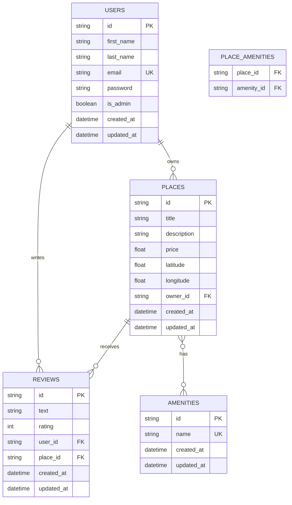

# HBnB Database Schema (Part 3)

```mermaid
erDiagram
    USERS ||--o{ PLACES : owns
    USERS ||--o{ REVIEWS : writes
    PLACES ||--o{ REVIEWS : receives
    PLACES }o--o{ AMENITIES : has

    USERS {
        string id PK
        string first_name
        string last_name
        string email UK
        string password
        boolean is_admin
        datetime created_at
        datetime updated_at
    }

    PLACES {
        string id PK
        string title
        string description
        float price
        float latitude
        float longitude
        string owner_id FK
        datetime created_at
        datetime updated_at
    }

    REVIEWS {
        string id PK
        string text
        int rating
        string user_id FK
        string place_id FK
        datetime created_at
        datetime updated_at
    }

    AMENITIES {
        string id PK
        string name UK
        datetime created_at
        datetime updated_at
    }

    PLACE_AMENITIES {
        string place_id FK
        string amenity_id FK
    }
```
